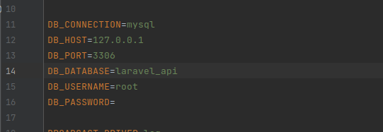

  

   
   

Test exercise (Laravel 10)
=============

API development in Laravel 10
____________
Minimum requirements
------------

* Server Apache
* Laravel 10
* PHP 8.1
* Mysql 7.0.33
* composer
____________
## Copy Git

https://github.com/Gurgen1995/laravel_api.git
____________
# Operations that will help in the analysis of the project

### Create a project of Laravel

composer create-project laravel/laravel laravel_api

### After creating the Laravel project "laravel_api", we go to the project catalog

cd laravel_api_import

### Enter the necessary data in the .env file to connect to the database

### Run the local server
php artisan serve

### Create a database migration

php artisan make:migration create_users_table

### Start the migration to create tables (users, companies, comments) in the database

php artisan migrate

____________
Ссылки для запуска импорта данных из API
--------------------
У нас созданы 4 таблицы в Базе данных:
* Stocks
* Incomes
* Orders
* Sales

Ссылки для запуска импорта данных из API для каждой таблицы:
* Route::get('/add-stocks', [StockController::class, 'addStock'])->name('stocks.addstock');
* Route::get('/add-incomes', [IncomeController::class, 'addIncome'])->name('incomes.addincome');
* Route::get('/add-orders', [OrderController::class, 'addOrder'])->name('orders.addorder');
* Route::get('/add-sales', [SaleController::class, 'addSale'])->name('sales.addsale');

Пример запуска импорта данных из API в таблицу Orders:

Ссылки для взаимодествия с каждой таблицей  (создание новой записи, просмотр, ректирование и удаление):
* Route::resource('stocks', 'App\Http\Controllers\StockController');
* Route::resource('incomes', 'App\Http\Controllers\IncomeController');
* Route::resource('orders', 'App\Http\Controllers\OrderController');
* Route::resource('sales', 'App\Http\Controllers\SaleController');

Пример просмотра таблицы Stocks:

### !!! В таблицах incomes, orders и sales даты получения данных указаны не текущие, так как за сегодняшний день отсутсвуют данные !!!
 
 
 

---

### Языки программирования и инструменты, которыми я пользуюсь:

&nbsp;
&nbsp;
&nbsp;
&nbsp;
&nbsp;
&nbsp;
&nbsp;
&nbsp;
&nbsp;

