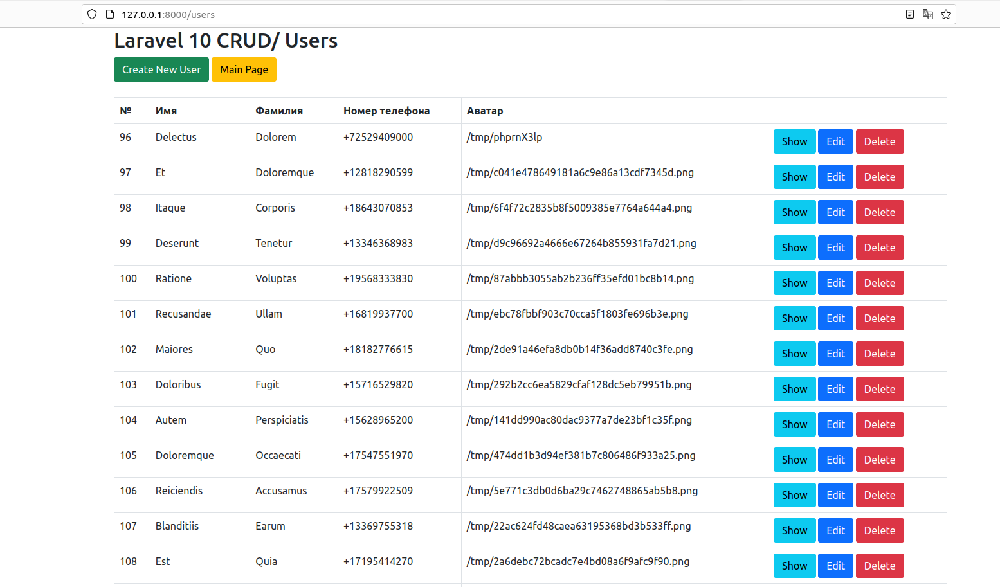
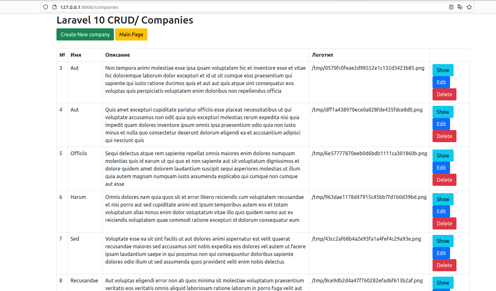
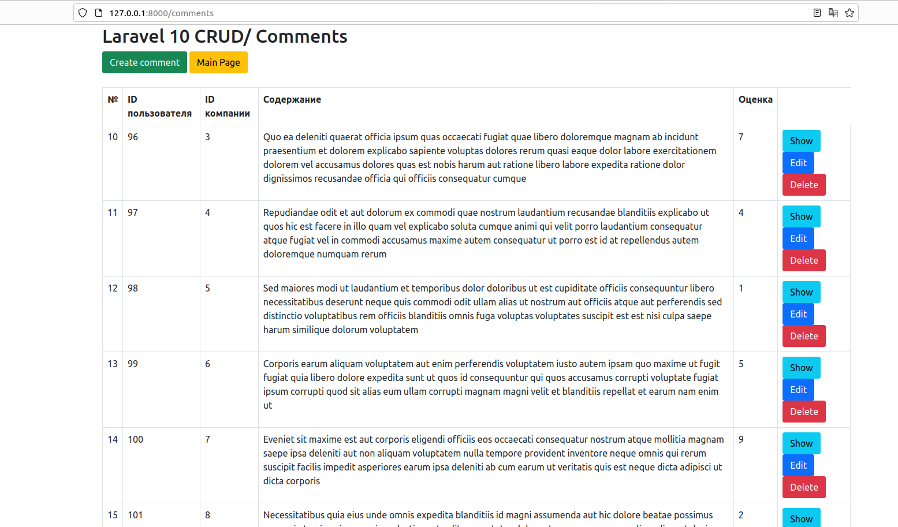
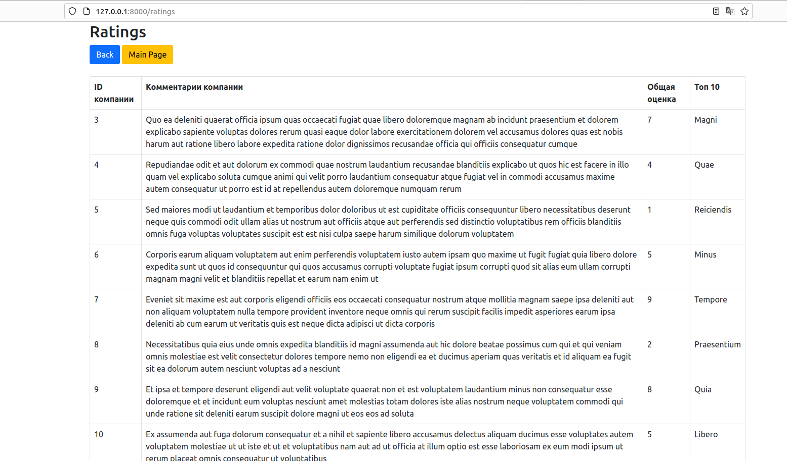

  

   
   

Test exercise (Laravel 10)
=============

API development in Laravel 10
____________
Minimum requirements
------------

* Server Apache
* Laravel 10
* PHP 8.1
* Mysql 7.0.33
* composer
____________
## Copy Git

https://github.com/Gurgen1995/laravel_api.git
____________
# Operations that will help in the analysis of the project

### Create a project of Laravel

composer create-project laravel/laravel laravel_api

### After creating the Laravel project "laravel_api", we go to the project catalog

cd laravel_api_import

### Enter the necessary data in the .env file to connect to the database

### Run the local server
php artisan serve

### Create a database migration

php artisan make:migration create_users_table

### Start the push in the GitHub

- git init
- git add .
- git commit -m "name commit"
- git branch -M main
- git remote add origin https://github.com/Gurgen1995/laravel_api.git
- git push -u origin main

### Start the migration to create tables (users, companies, comments) in the database

php artisan migrate
____________
### Creating models, controllers, seeds, factories

- php artisan make:model nameModel
- php artisan make:controller nameController
- php artisan make:seeder nameSeeder
- php artisan make:factory nameFactory

____________
## Links for interacting with each table  (creating a new record, viewing, rectifying and deleting):

- Route::resource('users', UserController::class);
  (http://127.0.0.1:8000/users)

- Route::resource('companies', CompanyController::class);
  (http://127.0.0.1:8000/companies)

- Route::resource('comments', CommentController::class);
  (http://127.0.0.1:8000/comments)
 
- Route::resource('ratings', RatingController::class);
  (http://127.0.0.1:8000/ratings)

---
## Used documentations:

- https://laravel.com/docs/10.x/installation
- https://laravel.com/docs/10.x/migrations
- https://laravel.com/docs/10.x/queries
- https://laravel.com/docs/10.x/seeding
- https://laravel.com/docs/10.x/eloquent-factories#main-content
---

### Языки программирования и инструменты, которыми я пользуюсь:

&nbsp;
&nbsp;
&nbsp;
&nbsp;
&nbsp;
&nbsp;
&nbsp;
&nbsp;
&nbsp;

